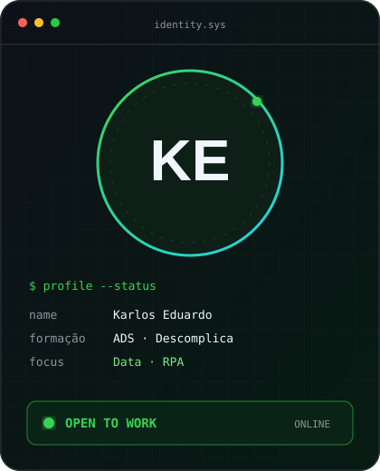
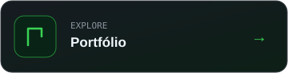

### `karlos@github ~ $ whoami`

  
  

### `karlos@github ~ $ ./contributions.sh`

<picture>
  <source media="(prefers-color-scheme: dark)" srcset="https://raw.githubusercontent.com/karlosqwer/Karlosqwer/output/github-contribution-grid-snake-dark.svg" />
  <source media="(prefers-color-scheme: light)" srcset="https://raw.githubusercontent.com/karlosqwer/Karlosqwer/output/github-contribution-grid-snake.svg" />
  
</picture>

### `karlos@github ~ $ ./connect.sh`

  
  
  

● DISPONÍVEL PARA ESTÁGIO OU POSIÇÃO JÚNIOR · PRESENCIAL OU REMOTA

