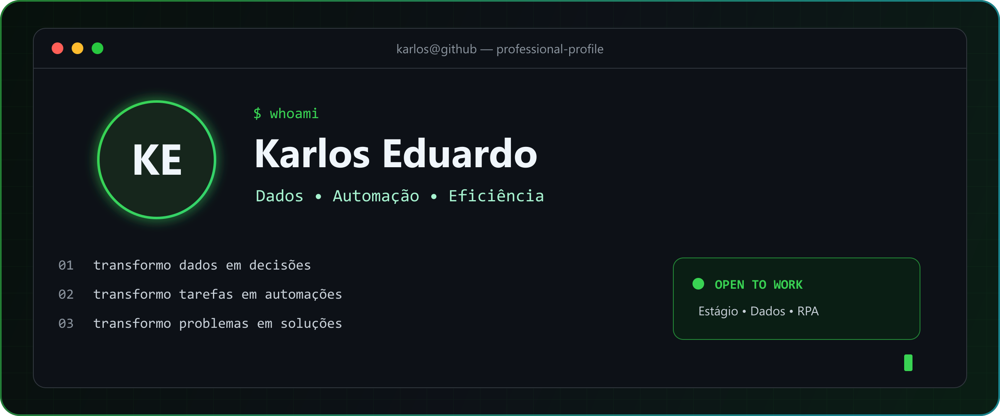
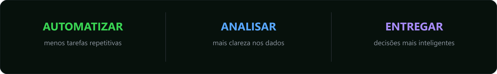

<div align="center">



[](https://karlosqwer.github.io/karlos-portfolio/)
[](https://www.linkedin.com/in/karlos-eduardo-414016253)
[](https://www.instagram.com/karlos_rs)
[](mailto:contatokarlos12@gmail.com)


</div>

## `01. sobre_mim` 👋

```python
class KarlosEduardo:
    formacao = "Análise e Desenvolvimento de Sistemas — Universidade Descomplica"
    localizacao = "Patos, Paraíba — Brasil"
    especialidade = ["Data Analytics", "RPA", "Automação de Processos"]
    objetivo = "Criar soluções que economizam tempo e melhoram decisões"
    experiencia = "Suporte de software, APIs e interfaces"
    oportunidade = "Estágio ou posição júnior — presencial ou remota"

    def proposta_de_valor(self):
        return "Dados que explicam. Automações que resolvem. Resultados que aparecem."
```

Não quero apenas escrever código. Quero entender o processo, encontrar o desperdício e construir uma solução que torne o trabalho **mais rápido, confiável e inteligente**.



## `02. como_eu_gero_valor` ⚡

<table>
<tr>
<td width="33%" align="center" valign="top">

### 🤖 Automatizo

Tarefas manuais e repetitivas usando Python, Selenium, APIs e fluxos bem documentados.

</td>
<td width="33%" align="center" valign="top">

### 📊 Analiso

Transformo dados brutos em indicadores, visualizações e informações úteis para decisões.

</td>
<td width="33%" align="center" valign="top">

### 🔗 Integro

Conecto sistemas, APIs e bancos de dados para criar processos consistentes de ponta a ponta.

</td>
</tr>
</table>

## `03. projetos_em_destaque` 🚀

<table>
<tr>
<td width="50%" valign="top">

### 👥 HR Analytics

Dashboard de **People Analytics** para transformar dados de RH em indicadores claros e acionáveis.

**500 colaboradores • 107.750 presenças • 1.542 avaliações**

`Python` `Pandas` `Streamlit` `Plotly` `MySQL`

[](https://github.com/karlosqwer/hr-analytics)

</td>
<td width="50%" valign="top">

### 💰 Sales Analytics SQL

Análise de vendas para explorar desempenho comercial e responder perguntas de negócio com dados.

`SQL` `MySQL` `Python` `Data Analysis`

[](https://github.com/karlosqwer/sales-analytics-sql)

</td>
</tr>
<tr>
<td width="50%" valign="top">

### 🌐 Portfólio Profissional

Minha apresentação profissional, reunindo projetos, competências e evolução na área de tecnologia.

`HTML` `CSS` `JavaScript` `GitHub Pages`

[](https://github.com/karlosqwer/karlos-portfolio)
[](https://karlosqwer.github.io/karlos-portfolio/)

</td>
<td width="50%" valign="top">

### ⚙️ CertSempre Automação

Interfaces desenvolvidas para um projeto de automação, conectando experiência visual e eficiência operacional.

`Front-end` `Automação` `CSS` `Processos`

[](https://github.com/karlosqwer/telas-certsempre)

</td>
</tr>
</table>

## `04. stack_tecnologica` 🧰

<div align="center">

#### Dados & Automação


#### Bancos, APIs & Desenvolvimento


#### Ferramentas


</div>

## `05. meu_fluxo_de_trabalho` 🔄

```text
ENTENDER          MAPEAR             CONSTRUIR          VALIDAR            MELHORAR
   │                 │                   │                  │                  │
   ▼                 ▼                   ▼                  ▼                  ▼
[Problema] ───► [Processo] ───► [Dados/Automação] ───► [Testes e Logs] ───► [Resultado]
```

- Entendo a necessidade antes de escolher a tecnologia.
- Estruturo o fluxo pensando em manutenção, exceções e rastreabilidade.
- Documento o processo para que a solução continue útil depois da entrega.
- Meço o resultado: tempo poupado, erros reduzidos e informação gerada.

## `06. atividade_no_github` 📈

<div align="center">


</div>

## `07. próximos_passos` 🎯

```yaml
agora:
  - aprofundar análise de dados com Python e SQL
  - criar automações web robustas e monitoráveis
  - transformar projetos em estudos de caso com resultados mensuráveis

próxima_oportunidade:
  tipo: estágio
  áreas: [Data Analytics, RPA, Automação]
  posso_contribuir_com: curiosidade, responsabilidade, visão de processo e vontade de evoluir
```

## `08. vamos_conversar` ☕

<div align="center">

### Tem um processo repetitivo ou dados esperando para contar uma história?

**Vamos transformar isso em uma solução.**

[](https://www.linkedin.com/in/karlos-eduardo-414016253)
[](https://karlosqwer.github.io/karlos-portfolio/)
[](mailto:contatokarlos12@gmail.com)

```text
> status: pronto para aprender, colaborar e construir algo que faça diferença_
```

<sub>Se este perfil chamou sua atenção, explore os projetos fixados ou entre em contato. 🚀</sub>

</div>
